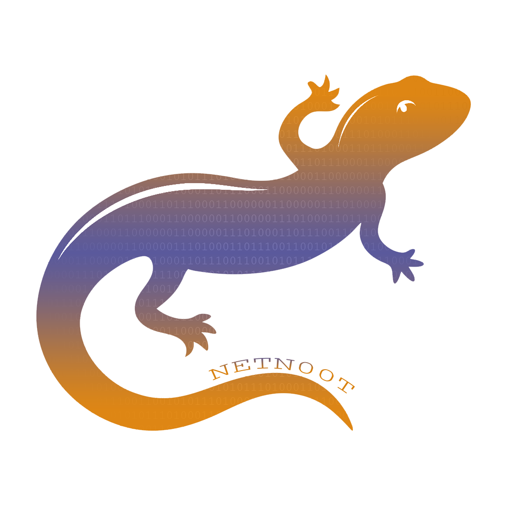
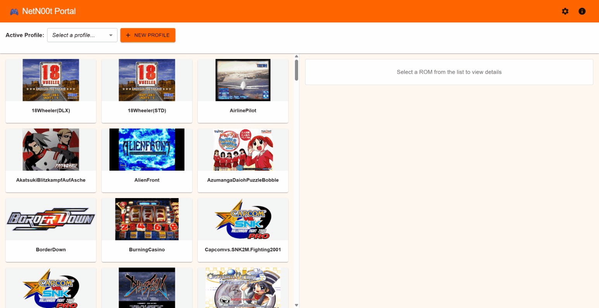

# NetN00t

<p align="center">
  
</p>

A self-contained web application for netbooting Sega arcade hardware. Point it at a directory of ROM files, create a board profile, and boot games from your browser.

**Supported hardware:** Naomi 1, Naomi 2, Triforce, Chihiro

---

## Requirements

- A net DIMM board installed in your arcade cabinet (the standard hardware required for netbooting)
- Your arcade board must be reachable on your local network — either connected to your LAN or wired directly to a host machine (e.g. a Raspberry Pi)
- ROM files (`.bin` format) sourced separately — this project provides no ROMs

---

## Installation

Pre-built packages for Linux (x86_64, arm64, and arm) are available on the [Releases](https://github.com/BluejayWagon/NetN00t/releases) page.

| Package suffix | Raspberry Pi models |
|----------------|---------------------|
| `linux_arm64` | Pi 3, 4, 5 — running a 64-bit OS |
| `linux_armv7` | Pi 2, 3, 4 — running a 32-bit OS |

### Debian / Ubuntu (including Raspberry Pi OS 64-bit)

```bash
sudo dpkg -i netn00t_*.deb
```

### RHEL / Fedora

```bash
sudo rpm -i netn00t_*.rpm
```

The package installs a systemd service that starts automatically on boot.

### Managing the service

```bash
sudo systemctl status netn00t
sudo systemctl restart netn00t
sudo systemctl stop netn00t
```

Logs are available via:

```bash
journalctl -u netn00t
```

---

## Configuration

Once running, open your browser to `http://localhost:8080`.

On first launch, use the settings page to configure:

- **ROM directory** — the path to your folder of `.bin` ROM files
- **Arcade board profiles** — one or more profiles, each with a name, board type, IP address, and monitor orientation

Configuration and profiles are stored in `/var/lib/netn00t/` (package installs) or the directory specified by `--data` (manual installs).

---

## Profiles

A profile represents one of your arcade cabinets. Each profile stores:

- **Name** — a label for the cabinet (e.g. "Naomi Cabinet 1")
- **Board type** — the hardware inside (Naomi 1, Naomi 2, Triforce, or Chihiro)
- **Monitor orientation** — horizontal or vertical (tate), used to filter out games that won't display correctly
- **IP address** — the IP assigned to the arcade board so NetN00t knows where to send the ROM.
- **Notes** — optional field for your own reference

You can create as many profiles as you have cabinets. The active profile is remembered between sessions.

### Automatic ROM filtering

When a profile is selected, the ROM list is automatically filtered to show only games compatible with that board type and monitor orientation. For example:

- A **Naomi 2** profile will show Naomi 1, Naomi 2, and Atomiswave games (Naomi 2 is backwards-compatible)
- A **Triforce** profile will show only Triforce games
- A profile set to **vertical** orientation will only show tate (vertical) games

This means you never have to manually hunt for compatible games — just pick your cabinet and browse.

---

## Usage

1. Open `http://<host-ip>:8080` in a browser
2. Select an arcade board profile from the profile selector
3. Browse the ROM list — it automatically filters to games compatible with your selected board
4. Click a ROM to view details, then click **Upload** to netboot it to the arcade board



---

## Running manually

If you prefer not to use the package, download the binary for your platform from the [Releases](https://github.com/BluejayWagon/NetN00t/releases) page and run it directly.

```bash
./netn00t --data ./config
```

| Flag | Default | Description |
|------|---------|-------------|
| `--data` | `./config` | Path to app data directory (stores ROM dir setting and profiles) |
| `--port` | `8080` | Port to listen on |

---

## Board compatibility

| Board | Plays |
|-------|-------|
| Naomi 1 | Naomi 1, Atomiswave |
| Naomi 2 | Naomi 1, Naomi 2, Atomiswave |
| Triforce | Triforce |
| Chihiro | Chihiro |

---

## Contributing

Contributions are welcome. The project is a Go backend with an embedded React (TypeScript/MUI) frontend.

**Prerequisites:**
- Go (version specified in `go.mod`)
- Node.js 20+

**Running in development:**

```bash
# Start the backend (API only)
go run . -mode=dev -data=./config

# In a separate terminal, start the frontend dev server
cd frontend/netn00t-fe
npm install
npm start
```

The React dev server proxies `/api/*` requests to `:8080`. Open `http://localhost:3000`.

**Running tests:**

```bash
# Go tests
go test ./...

# Frontend tests
cd frontend/netn00t-fe
npm test -- --watchAll=false
```

**Building a production binary:**

```bash
cd frontend/netn00t-fe && npm run build && cd ../..
go build -o netn00t .
```

**Adding ROM metadata:** Edit [file/romConfig.json](file/romConfig.json) — each entry needs `name`, `fileName`, `pictureName`, `boardType`, `genre`, `tate` (bool), and `description`. ROM artwork goes in [file/images/](file/images/).

---

## License

MIT — see [LICENSE](LICENSE)
